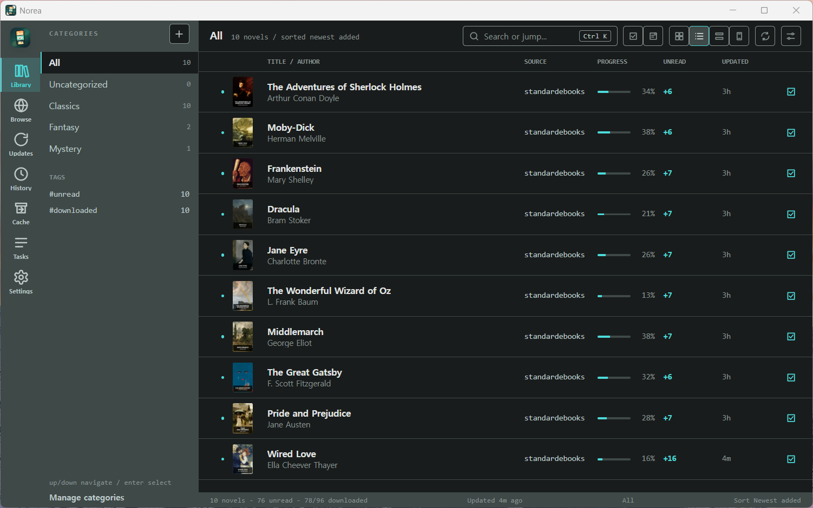
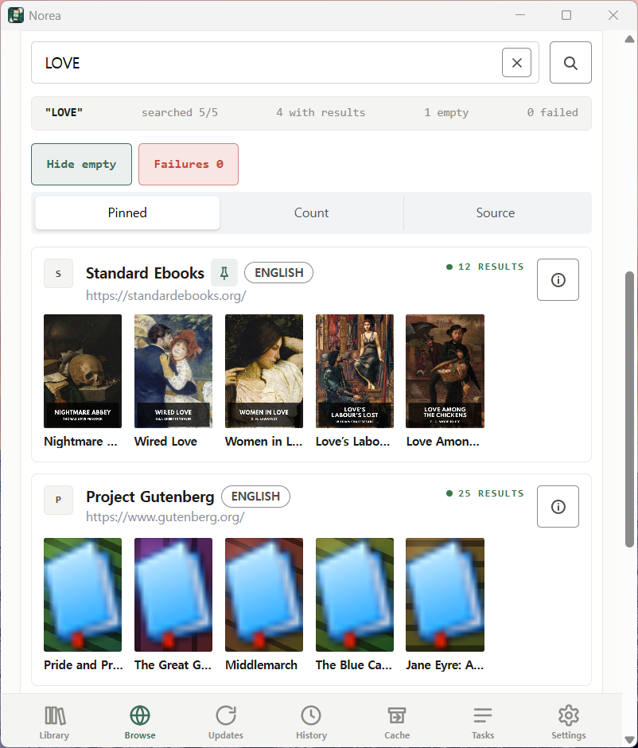
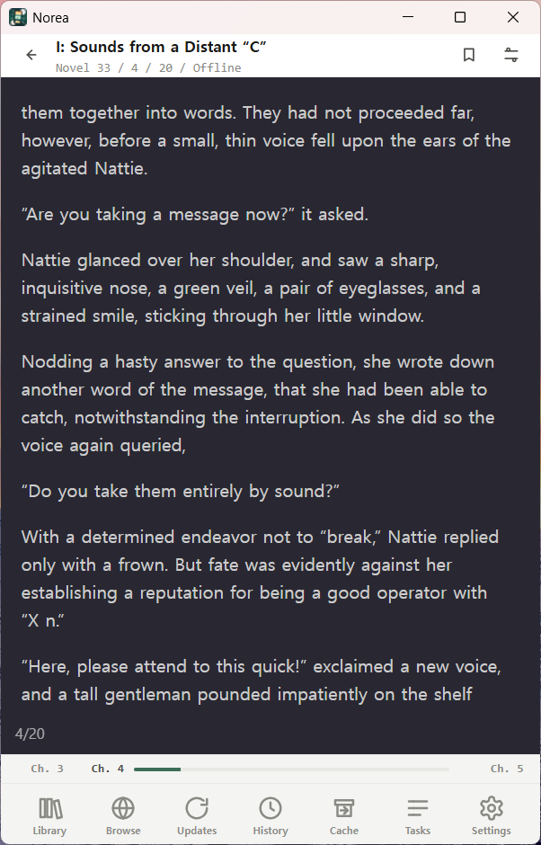
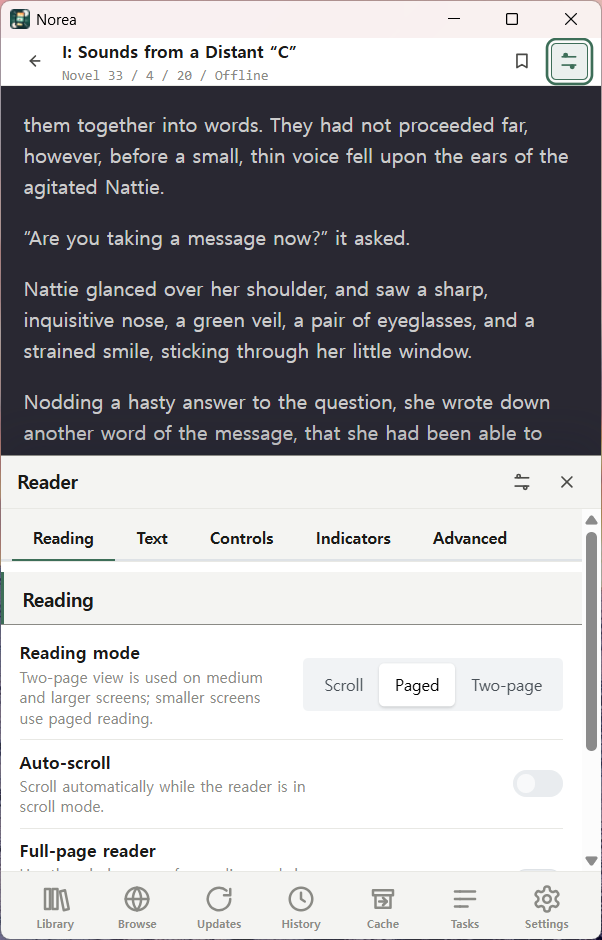

# Norea

Norea is a local-first light-novel reader for Windows, Linux, and Android.
It keeps your reading sources, library, downloads, and progress in one app.

Norea is inspired by [lnreader/lnreader](https://github.com/lnreader/lnreader),
but it is a separate app with its own data, backup, and source system.

## Screenshots

<p align="center">
  
</p>

<p align="center">
  
  
  
</p>

## What You Can Do

- Browse and search installed reading sources.
- Add novels to your library and organize them with categories.
- Read in paged or scrolling mode.
- Change themes, font size, text color, tap zones, and keyboard navigation.
- Track reading progress, history, unread chapters, and downloaded chapters.
- Download chapters for later reading.
- Export and import local backups for your library, progress, categories,
  source settings, and downloaded chapters.

## Current State

Norea is usable for testing, but it is not a polished app-store release yet.

Current limits:

- macOS and iOS are not planned right now.
- Some protected sources may ask you to open the in-app site browser once before
  search or downloads work.
- Android background downloads still need more device testing.
- There is no in-app updater yet. Check GitHub for newer builds.

## Download

For regular installs, use the
[latest GitHub release](https://github.com/tinywind/norea/releases/latest).
Release assets are the stable public downloads.

For a newer tester build from the current `main` branch, use GitHub Actions:

1. Open the latest successful workflow run for your platform:
   [Windows](https://github.com/tinywind/norea/actions/workflows/windows.yml),
   [Linux](https://github.com/tinywind/norea/actions/workflows/linux.yml), or
   [Android](https://github.com/tinywind/norea/actions/workflows/android.yml).
2. Open the run and scroll to Artifacts.
3. Download the matching artifact:

| Platform | What to download |
| --- | --- |
| Windows x64 | `norea-windows-x64-nsis` or `norea-windows-x64-msi` |
| Windows ARM64 | `norea-windows-arm64-nsis` or `norea-windows-arm64-msi` |
| Linux x64 | `norea-linux-x64-appimage`, `norea-linux-x64-deb`, or `norea-linux-x64-rpm` |
| Linux ARM64 | `norea-linux-arm64-appimage`, `norea-linux-arm64-deb`, or `norea-linux-arm64-rpm` |
| Android phone or tablet | `norea-arm64-signed-release-apk` |
| Android emulator or WSA | `norea-x86_64-signed-release-apk` |

Workflow artifacts are tester downloads and are kept for 30 days. If an
artifact is expired, use a newer successful run or the latest release.

## First Run

1. Install and open Norea.
2. Add a reading source list from Browse -> Sources.
3. Install one or more sources.
4. Search a source, open a novel, and add it to your library.
5. Open a chapter to read. Download chapters you want available later.

## Add Reading Sources

Reading sources are installed separately from the app. The sample source list is
maintained at [tinywind/norea-plugins](https://github.com/tinywind/norea-plugins)
and focuses on public-domain, open-license, official-API, and user-owned
self-hosted examples.

To add the sample source list:

1. Open Browse -> Sources.
2. Choose Set repository.
3. Paste this URL:

   ```text
   https://raw.githubusercontent.com/tinywind/norea-plugins/plugins/v0.1.0/.dist/plugins.min.json
   ```

4. Save it.
5. Install sources from Available source plugins.

Only install and use sources you are allowed to access in your country and under
the source site's terms.

## Backup

Use Settings -> Backup to export or import your local library data. Backups
include your library, progress, categories, source settings, and downloaded
chapter content.

## For Developers

Developer setup, local plugin testing, release artifact details, and
contribution rules live in [docs/development.md](./docs/development.md).

## License

MIT. Upstream assets and translation seeds remain MIT-compatible and are
credited in the app where relevant.
