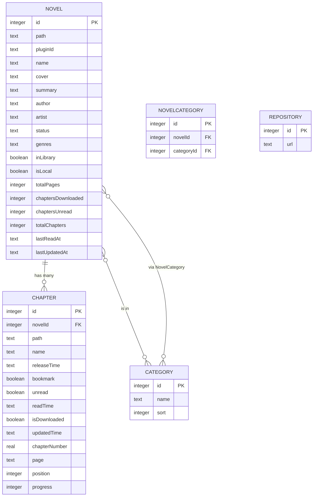

# Domain Model & ERD

> Tier 2.5. Reproduces the upstream lnreader domain at commit
> `639a2538` so the rewrite uses the same nouns and the same row
> shapes. The drizzle schema files in [`src/database/schema/`](../../src/database/schema/)
> are the **authoritative** source — copied verbatim from upstream.
> This document is the human-readable companion: relationships,
> invariants, and lifecycles that are not visible from the schema
> alone.

## 1. Entities at a glance

| Entity | Table | Notes |
|---|---|---|
| Novel | `Novel` | A title in the user's library or browsable from a source. |
| Chapter | `Chapter` | One readable unit, owned by a novel. |
| Category | `Category` | User-defined grouping shown as Library tabs. |
| NovelCategory | `NovelCategory` | Many-to-many bridge between Novel and Category. |
| Repository | `Repository` | Plugin source registry (URL pointing at a JSON catalog). |

The new app starts with these five tables. Trackers and other
non-essential metadata are scoped out of the v0.1 rewrite — see
`prd.md §3` for the cuts.

## 2. ER diagram



The bridge to Category goes through the `NovelCategory` join table —
the diagram lists the relationship twice on purpose to make that
explicit.

## 3. Invariants

### 3.1 Novel uniqueness

`UNIQUE (path, pluginId)` (drizzle: `novel_path_plugin_unique`). One
canonical Novel row per (source plugin, path-on-source) pair.
Insert-or-update queries should match on this composite key.

### 3.2 Chapter uniqueness

`UNIQUE (novelId, path)` (drizzle: `chapter_novel_path_unique`). One
canonical Chapter row per (novel, path-on-source) pair.

### 3.3 Category uniqueness

`UNIQUE (name)` (drizzle: `category_name_unique`). Category names are
the user-visible identity.

### 3.4 NovelCategory uniqueness

`UNIQUE (novelId, categoryId)` (drizzle: `novel_category_unique`). A
novel cannot be in the same category twice.

### 3.5 Repository uniqueness

`UNIQUE (url)` (drizzle: `repository_url_unique`).

### 3.6 The "Default" category

A row with `name = 'Default'` and `sort = 1` is created on first run
and is the de facto home for novels added without an explicit category
selection. Restore must preserve it.

## 4. Lifecycles

### 4.1 Novel lifecycle

```
[Source result] →  insert if (pluginId, path) unseen, else update
                   inLibrary = false on insert
                ↓
[User taps "Add to library"] →  inLibrary = true; default category attached
                ↓
[User reads chapters] →  Chapter.unread flips, Novel.chaptersUnread recomputed
                ↓
[User removes] →  inLibrary = false; chapters preserved (re-add restores state)
```

`isLocal = true` is a separate path: novels created from a local EPUB or
HTML import. Their `pluginId` is `'local'` and they are not refreshable.

### 4.2 Chapter lifecycle

```
[Plugin scrape] →  insert if (novelId, path) unseen, update name/releaseTime/etc otherwise
                ↓
[Download] →  isDownloaded = true; HTML/images written to disk
                ↓
[Read]   →  unread = false; readTime = now; progress (0-100) incremented
                ↓
[Bookmark toggle] →  bookmark flips
                ↓
[Delete download] →  isDownloaded = false; on-disk files removed (chapter row stays)
```

`progress` is monotonic non-decreasing — the reader never persists a
smaller progress value. See [reader spec §7](../reader/specification.md#7-page-to-progress-mapping).

`page` is a chapter pagination cursor for sources that paginate inside
a single chapter (default `'1'`). Most sources don't use it.

`position` is the in-novel ordering (1-indexed in upstream's UX).
`chapterNumber` is what the source reported (often a decimal like
`12.5`).

### 4.3 Category lifecycle

User CRUD via the Categories screen. Sort order via drag-and-drop
(updates `sort`, an integer). Deletion removes the `NovelCategory`
rows pointing at it; the novels themselves are untouched.

The Default category is special-cased in upstream: it cannot be deleted, only renamed.

### 4.4 Repository lifecycle

User adds a repo URL (`Repository.url`); the manager fetches the JSON
catalog at that URL on demand. Removing the repo does not uninstall
the plugins it provided — those continue to work from the on-disk
plugin storage until the user uninstalls each plugin.

## 5. Computed fields (always derived, never stored as user data)

These columns are caches, kept in sync by triggers / queries:

- `Novel.chaptersDownloaded` — `count(Chapter where novelId = this and isDownloaded)`
- `Novel.chaptersUnread` — `count(Chapter where novelId = this and unread)`
- `Novel.totalChapters` — `count(Chapter where novelId = this)`
- `Novel.totalPages` — sum of chapter pages or `null` if unknown.

Restore (per [backup format §7.2](../backup/format.md#72-merge-added-in-upstream-commit-401aa7c8))
**recomputes these from the merged Chapter rows** rather than carrying
the backup's count blindly.

## 6. Indices

Beyond uniqueness constraints, the schema declares query-shape indices:

- `Novel.NovelIndex` on `(pluginId, path, id, inLibrary)` — accelerates
  scrape-result upserts and library filters.
- `Chapter.chapterNovelIdIndex` on `(novelId, position, page, id)` —
  accelerates chapter list rendering and "next chapter" navigation.
- `Category.category_sort_idx` on `(sort)` — accelerates ordered
  Library tab rendering.

The new app should keep these — drizzle's `sqlite-proxy` adapter
honors them when running through `tauri-plugin-sql`.

## 7. Pseudo-plugin: `local`

`pluginId = 'local'` is reserved. Novels created by the local-import
flow have:

- `pluginId = 'local'`
- `path = ` an opaque user-chosen identifier (the EPUB filename, etc.)
- `isLocal = true`
- No corresponding repository row.

Plugin runtime calls (`getPlugin`, `installPlugin`, `updatePlugin`)
return `undefined` for `'local'`. UI must hide source-specific actions
(View on web, Update from source, etc.) for these novels.

## 8. Migration history

Drizzle migrations are in [`drizzle/`](../../drizzle/). Current head:
`20251222152612_past_mandrill`. The new app's first migration should
match this state exactly so existing user databases (imported via
backup) can be opened without a migration step.

If the rewrite needs a schema change, **append** a new migration —
never edit the past one. drizzle-kit will detect the new migration
name and apply it incrementally.

## 9. References

- Schema files (verbatim copy): [`src/database/schema/`](../../src/database/schema/)
- Drizzle migrations (verbatim copy): [`drizzle/`](../../drizzle/)
- Domain query helpers (upstream): <https://github.com/lnreader/lnreader/tree/639a2538/src/database/queries>
- Database types (upstream): <https://github.com/lnreader/lnreader/tree/639a2538/src/database/types>
