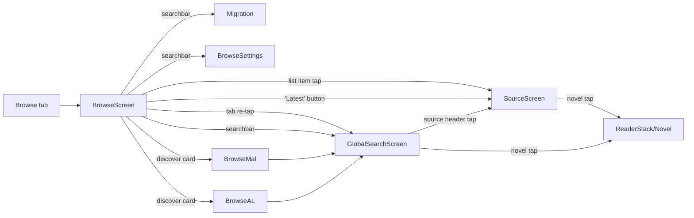

# Browse + Source + Global Search

> Sourced from upstream lnreader at commit 639a2538:
> - `src/screens/browse/BrowseScreen.tsx` (lines 1-120)
> - `src/screens/browse/components/AvailableTab.tsx` (lines 1-264)
> - `src/screens/browse/components/InstalledTab.tsx` (lines 1-217)
> - `src/screens/browse/components/PluginListItem.tsx` (lines 1-267)
> - `src/screens/browse/components/DeferredPluginListItem.tsx` (lines 1-35)
> - `src/screens/browse/components/PluginListItemSkeleton.tsx` (lines 1-147)
> - `src/screens/browse/components/Modals/SourceSettings.tsx` (lines 1-270)
> - `src/screens/browse/discover/DiscoverCard.tsx` (lines 1-73)
> - `src/screens/browse/discover/MalTopNovels.tsx` (lines 1-193)
> - `src/screens/browse/discover/AniListTopNovels.tsx` (lines 1-245)
> - `src/screens/browse/loadingAnimation/SourceScreenSkeletonLoading.tsx` (lines 1-112)
> - `src/screens/browse/loadingAnimation/GlobalSearchSkeletonLoading.tsx` (lines 1-51)
> - `src/screens/browse/loadingAnimation/MalLoading.tsx` (lines 1-95)
> - `src/screens/browse/settings/BrowseSettings.tsx` (lines 1-107)
> - `src/screens/browse/settings/modals/ConcurrentSearchesModal.tsx` (lines 1-57)
> - `src/screens/browse/migration/Migration.tsx` (lines 1-72)
> - `src/screens/browse/SourceNovels.tsx` (lines 1-64)
> - `src/screens/BrowseSourceScreen/BrowseSourceScreen.tsx` (lines 1-201)
> - `src/screens/BrowseSourceScreen/useBrowseSource.ts` (lines 1-182)
> - `src/screens/BrowseSourceScreen/components/FilterBottomSheet.tsx` (lines 1-479)
> - `src/screens/GlobalSearchScreen/GlobalSearchScreen.tsx` (lines 1-95)
> - `src/screens/GlobalSearchScreen/hooks/useGlobalSearch.ts` (lines 1-197)
> - `src/screens/GlobalSearchScreen/components/GlobalSearchResultsList.tsx` (lines 1-222)
> - `src/hooks/persisted/usePlugins.ts` (lines 1-217)
> - `src/hooks/persisted/useSettings.ts` (lines 85-89, 193-196, 254-265)
> - `src/plugins/pluginManager.ts` (lines 117-216)
> - `src/navigators/Main.tsx` (lines 23-124)

## 1. Purpose

Browse is the entry point for finding novels outside the user's library. It owns three jobs:

1. **Plugin lifecycle** – list available plugins from the configured repositories, install / update / uninstall / pin them.
2. **Source catalog browsing** – open one installed plugin, paginate its popular or latest novels, filter, and per-source search.
3. **Global search** – fan a single query across every installed plugin in parallel and stream results as each plugin replies.

Browse never persists novels to the database on its own. It hands a `NovelItem` (`{ name, path, cover }`) plus the plugin id to the Novel screen, which performs the actual `parseNovel` and "add to library" work.

## 2. Routes / Entry points

Stack screens registered in `src/navigators/Main.tsx:23-124`:

| Route name | Component | Params | Notes |
|---|---|---|---|
| `Browse` (tab) | `BrowseScreen` | – | Bottom-tab. Tapping the tab again navigates to `GlobalSearchScreen` (`BrowseScreen.tsx:46-56`). |
| `SourceScreen` | `BrowseSourceScreen` | `{ pluginId, pluginName, site, showLatestNovels? }` | One source's catalog. |
| `GlobalSearchScreen` | `GlobalSearchScreen` | `{ searchText? }` | Multi-source search. Optionally pre-filled (deep link from MAL/AL discover). |
| `BrowseMal` | `MalTopNovels` | – | MyAnimeList top light novels. Tap → `GlobalSearchScreen` with `searchText` set. |
| `BrowseAL` | `AniListTopNovels` | – | AniList novels (requires AniList tracker login). |
| `Migration` | `Migration` | – | Per-source list of in-library novels for migration. Spec lives in onboarding-utility doc; only entry point covered here. |
| `SourceNovels` | `SourceNovels` | `{ pluginId }` | Used from `Migration` to pick a novel to migrate. |
| `BrowseSettings` | `BrowseSettings` | – | Languages filter, discover toggles, global-search concurrency. |
| `RespositorySettings` | `SettingsRepositoryScreen` (in `MoreStack`) | `{ url? }` | Where users add/remove plugin repos. Linked from the empty-state in Available tab. |

Searchbar action icons in `BrowseScreen` (`BrowseScreen.tsx:27-44`) launch: `book-search` → GlobalSearchScreen, `swap-vertical-variant` → Migration, `cog-outline` → BrowseSettings.

## 3. Layout

Three sub-sections.

### 3.1 Browse tab (`BrowseScreen`)

`SafeAreaView` (`excludeBottom`) → top `SearchbarV2` (placeholder `browseScreen.searchbar`, right icons: global-search / migration / settings) → `TabView` with two routes (`BrowseScreen.tsx:16-19`):

- **Installed** (default, index 0) – `InstalledTab`.
- **Available** (index 1) – `AvailableTab`.

`swipeEnabled` is **false** (`BrowseScreen.tsx:114`); switching tabs requires tapping the TabBar. If `languagesFilter.length === 0`, both routes render an `EmptyView` (`browseScreen.listEmpty`, `BrowseScreen.tsx:74-82`).

Installed tab content order (`InstalledTab.tsx:111-204`):

1. **Discover** header + `DiscoverCard` for AniList / MyAnimeList (each gated by `showAniList` / `showMyAnimeList`).
2. **Pinned plugins** header + list of pinned `PluginListItem`s (only shown when `searchText` is empty).
3. **Last used** header + the most recently opened plugin (`InstalledTab.tsx:163-182`; only when the last-used plugin is not already pinned and `searchText` is empty).
4. **All / Search results** header + the rest. Header label flips between `installedPlugins` and `searchResults` (`InstalledTab.tsx:186-191`).

Each list row is a `DeferredPluginListItem` – it renders a `PluginListItemSkeleton` first and swaps to the real `PluginListItem` after `InteractionManager.runAfterInteractions` resolves (`DeferredPluginListItem.tsx:20-34`). This avoids janking the TabView swap animation.

Available tab content (`AvailableTab.tsx:120-219`) is a `LegendList` of `AvailablePluginCard`s grouped by language. The grouping is computed inline: items are sorted by `lang.localeCompare`, and each card flags `header: true` when its `lang` differs from the previous item (`AvailableTab.tsx:138-145`). The header text is the localized language name (`getLocaleLanguageName(plugin.lang)`).

### 3.2 Source view (`BrowseSourceScreen`)

`SafeAreaView` → `SearchbarV2` (placeholder `"Search <pluginName>"`, left icon `magnify`, back action wired to `navigation.goBack`, right icon `earth` → opens the plugin site in `WebviewScreen`) → body.

Body has three states (`BrowseSourceScreen.tsx:101-162`):

- Loading → `SourceScreenSkeletonLoading` (renders a grid of shimmer cards sized to `novelsPerRow` from `LibrarySettings`; landscape forces 6 columns).
- Error / empty → `ErrorScreenV2` with a Retry action that calls `searchSource` if there is a `searchText`, else `refetchNovels`.
- Loaded → `NovelList` (`inSource` prop set; cover renderer is `NovelCover` with `globalSearch={false}`). `onEndReached` paginates: in search mode it calls `searchNextPage`, otherwise `fetchNextPage` (`BrowseSourceScreen.tsx:151-160`).

Floating Action Button: a `filter-variant` FAB anchored bottom-right, labeled "Filter" (`BrowseSourceScreen.tsx:165-179`). Visible **only** when `!showLatestNovels && filterValues && !searchText`. Pressing it presents the `FilterBottomSheet` modal, which renders one of five filter widgets per filter key:

- `FilterTypes.TextInput` – outlined `TextInput`.
- `FilterTypes.Picker` – `TextInput` with a `Menu` of options.
- `FilterTypes.CheckboxGroup` – collapsible header + `Checkbox` list.
- `FilterTypes.Switch` – row with a `Switch`.
- `FilterTypes.ExcludableCheckboxGroup` – tri-state checkbox (off / include / exclude) (`FilterBottomSheet.tsx:235-326`).

Bottom sheet has a Reset button (resets to plugin defaults via `clearFilters`) and a Filter button (calls `setFilters(selectedFilters)` then closes the sheet, which re-runs `fetchNovels(1, …)`).

### 3.3 Global search (`GlobalSearchScreen`)

`SafeAreaView` → `SearchbarV2` (no action icons) → optional `ProgressBar` while `progress > 0 && progress < 1` → optional "Has results" `SelectableChip` filter (only shown after `progress > 0`, `GlobalSearchScreen.tsx:58-70`) → `GlobalSearchResultsList`.

The results list is one row per installed plugin. Each row has:

- A header (`Pressable`) with the plugin's name + lang + a right-chevron, which navigates to `SourceScreen` for that plugin.
- Body that depends on per-row state:
  - Loading → `GlobalSearchSkeletonLoading` (4 horizontal shimmer covers).
  - Error → red error text (`#B3261E` / `#F2B8B5` depending on theme).
  - Loaded → horizontal `FlatList` of `NovelCover`s with `globalSearch` prop. Empty → "No results found" line.

Sort order (see `novelResultSorter` in `useGlobalSearch.ts:182-197`): plugins with results come first, ties broken alphabetically by plugin name. This keeps populated rows at the top while empty/loading rows drop to the bottom.

## 4. Major UI components

| Component | File | Role |
|---|---|---|
| `BrowseScreen` | `src/screens/browse/BrowseScreen.tsx` | Tab host + searchbar |
| `InstalledTab` | `src/screens/browse/components/InstalledTab.tsx` | Installed plugins, discover cards, pinned/last-used sections |
| `AvailableTab` | `src/screens/browse/components/AvailableTab.tsx` | Available plugins grouped by language, install action |
| `PluginListItem` | `src/screens/browse/components/PluginListItem.tsx` | One installed plugin row. Swipe-right reveals web / pin / delete; trailing widgets are update-icon (when `hasUpdate`), settings-icon (when `hasSettings`), and "Latest" button. |
| `DeferredPluginListItem` | `src/screens/browse/components/DeferredPluginListItem.tsx` | Skeleton-first wrapper for `PluginListItem` |
| `PluginListItemSkeleton` | `src/screens/browse/components/PluginListItemSkeleton.tsx` | Static, non-interactive variant rendered before interactions complete |
| `SourceSettingsModal` | `src/screens/browse/components/Modals/SourceSettings.tsx` | Modal that renders `pluginSettings` (Switch / Select / CheckboxGroup / TextInput) and persists answers via the plugin's `Storage` |
| `DiscoverCard` | `src/screens/browse/discover/DiscoverCard.tsx` | Row that opens MAL/AL screens |
| `BrowseSourceScreen` | `src/screens/BrowseSourceScreen/BrowseSourceScreen.tsx` | One-source catalog and per-source search |
| `FilterBottomSheet` | `src/screens/BrowseSourceScreen/components/FilterBottomSheet.tsx` | Filter UI |
| `useBrowseSource` / `useSearchSource` | `src/screens/BrowseSourceScreen/useBrowseSource.ts` | State machines for catalog pagination and search pagination respectively |
| `GlobalSearchScreen` | `src/screens/GlobalSearchScreen/GlobalSearchScreen.tsx` | Multi-source query host |
| `GlobalSearchResultsList` | `src/screens/GlobalSearchScreen/components/GlobalSearchResultsList.tsx` | Per-source row with horizontal cover strip |
| `useGlobalSearch` | `src/screens/GlobalSearchScreen/hooks/useGlobalSearch.ts` | Concurrency-bounded fan-out with focus pause and cancellation |

For the `PluginItem` / `Plugin` types used everywhere, see [docs/plugins/contract.md](../plugins/contract.md). This screen does not redefine them.

## 5. States

Per surface:

| Surface | Empty | Loading | Error | Loaded | No-results | Search-active | Filtering | CF-blocked |
|---|---|---|---|---|---|---|---|---|
| Browse / Installed | `EmptyView` "no languages enabled" if `languagesFilter` is empty (`BrowseScreen.tsx:74-82`); else just no headers | Per-row skeleton (deferred) | Toast on install/uninstall/update failure | Headers + rows | Rows just disappear via the in-place filter; no dedicated empty render | Hides pinned/last-used sections, swaps header label | n/a | n/a |
| Browse / Available | `EmptyView` "No repositories yet…" with action button → RespositorySettings (`AvailableTab.tsx:185-217`) | `RefreshControl` spinner during `refreshPlugins()` | Toast | Cards grouped by language | "No plugins available for this search term" | Filters list | n/a | n/a |
| Source view | – | `SourceScreenSkeletonLoading` | `ErrorScreenV2` with Retry | `NovelList` | Same `ErrorScreenV2` (`error || sourceScreen.noResultsFound`) | `useSearchSource` is the active state machine; FAB hidden | `FilterBottomSheet` open; Reset / Filter buttons | UNKNOWN: source view does not detect CF-block specifically; the plugin itself either succeeds via the in-app fetch retry or surfaces the upstream error string. See [cloudflare-bypass.md](../plugins/cloudflare-bypass.md). |
| Global search | `EmptyView` "Search in all sources" before any query (`GlobalSearchScreen.tsx:73-81`) | Per-row skeleton + top `ProgressBar` | Per-row red error text | Mixed across rows | Per-row "No results found" line | Always — every render is search-driven | "Has results" chip toggles `hasResultsOnly` filter (hides loading/error/empty rows) | Plugin reports its CF error string in the per-row `error` field; row is treated as a normal error |

The `progress` value in `useGlobalSearch` increments by `1 / filteredInstalledPlugins.length` per finished plugin — the `ProgressBar` mounts when `progress > 0` and the chip filter mounts on the same condition (`GlobalSearchScreen.tsx:52-70`).

## 6. Interactions

Browse / Installed tab row (`PluginListItem.tsx:122-211`):

- **Tap row** → `navigateToSource(plugin)` (sets `lastUsedPlugin`, navigates to `SourceScreen` with `showLatestNovels=false`).
- **Tap "Latest" button** → same, with `showLatestNovels=true`. The plugin's `popularNovels` receives `{ showLatestNovels: true }`.
- **Tap update icon** (visible when `item.hasUpdate || __DEV__`) → `updatePlugin(item)`; toast with new version on success, plugin error message on failure.
- **Tap settings cog** (visible when `hasSettings`) → opens `SourceSettingsModal` with the plugin's `pluginSettings` schema.
- **Swipe right** (`Swipeable`, `dragOffsetFromRightEdge: 30`) → reveals web / pin / delete buttons. Web → `WebviewScreen`. Pin → toggles `pinnedPlugins`. Delete → `ConfirmationDialog` then `uninstallPlugin`.

Browse / Available tab row (`AvailableTab.tsx:46-118`):

- **Tap download icon** → `installPlugin(plugin)`. Visual: the row's `ratio` shared value animates `withTiming(0, { duration: 500 })` so the row collapses; on failure the ratio is restored to 1.
- **Pull to refresh** → `refreshPlugins()`.

Source view:

- **Submit searchbar** → `searchSource(searchText)` resets `searchResults`/`currentPage`/`hasNextSearchPage` (`useBrowseSource.ts:120-126`).
- **Clear searchbar** → `clearSearchResults` (returns to popular/latest list).
- **Long-press cover** → `switchNovelToLibrary(item.path, pluginId)` via `LibraryContext`. Opacity drop while `inActivity[item.path] === true` (`BrowseSourceScreen.tsx:139-146`).
- **Tap cover** → `ReaderStack/Novel` with `{ ...item, pluginId }`.
- **End reached** → next page (popular or search depending on whether `searchText` is set).
- **Filter FAB** → opens bottom sheet.
- **Earth icon** → `WebviewScreen` with the plugin site.

Global search:

- **Type in searchbar** → `setSearchText`. The hook debounces 300 ms (`useGlobalSearch.ts:155-158`) before fanning out.
- **Submit/Clear** → handled by the same `searchText` change.
- **Tap source header** → `SourceScreen` for that plugin.
- **Tap cover** / **long-press cover** → same as Source view (open novel / toggle library).
- **Toggle "Has results" chip** → re-filter `searchResults` to rows with `novels.length > 0` and no error.
- **Navigate to a sub-screen (e.g. Novel)** → `useFocusEffect` flips `isFocused.current = false`, which **pauses** the for-loop in the fan-out (it `await`s a 100 ms `setTimeout` until refocused, `useGlobalSearch.ts:34-40, 113-115, 139-141`).

## 7. Affecting settings

`BrowseSettings` (`useBrowseSettings`, defined in `useSettings.ts:85-89, 193-196, 254-265`):

| Key | Default | Effect |
|---|---|---|
| `showMyAnimeList` | `true` | Whether the MAL discover card is shown in InstalledTab |
| `showAniList` | `true` | Whether the AniList discover card is shown in InstalledTab |
| `globalSearchConcurrency` | `3` | Max concurrent plugin searches in `useGlobalSearch`. `1`-`10` (radio modal). When `1`, the loop is sequential and awaits each plugin (`useGlobalSearch.ts:111-149`). |

`usePlugins` (`hooks/persisted/usePlugins.ts`) persists via MMKV under these keys (`usePlugins.ts:17-23`):

| Key | Type | Notes |
|---|---|---|
| `AVAILABLE_PLUGINS` | `PluginItem[]` | Raw merge of all repository responses (`fetchPlugins`, `pluginManager.ts:170-187`). De-duplicated via `uniqBy(reverse, 'id')` so later repositories win. |
| `INSTALL_PLUGINS` | `PluginItem[]` | Currently installed plugins (note: the storage key string is `INSTALL_PLUGINS`, not `INSTALLED_PLUGINS`) |
| `LANGUAGES_FILTER` | `string[]` | Defaults to one entry computed from `expo-localization` `getLocales()` (`usePlugins.ts:26-34`) |
| `LAST_USED_PLUGIN` | `PluginItem` | Set on every `SourceScreen` open |
| `PINNED_PLUGINS` | `string[]` (plugin ids) | Toggled via swipe action |
| `FILTERED_AVAILABLE_PLUGINS` | `PluginItem[]` | Pre-computed (available minus installed, filtered by language) |
| `FILTERED_INSTALLED_PLUGINS` | `PluginItem[]` | Pre-computed (installed filtered by language) |

`AppSettings` consumed: `disableLoadingAnimations` is read by `MalLoading` (and other shimmer placeholders) to stop shimmer animation.

`LibrarySettings` consumed by `SourceScreenSkeletonLoading`: `displayMode` (selects List vs grid skeleton) and `novelsPerRow`.

The plugin repository list itself lives in the SQLite `Repository` table and is managed by `RespositorySettings` (`MoreStack`). Browse only **reads** repositories indirectly via `fetchPlugins` (`pluginManager.ts:170-187`), which calls `getRepositoriesFromDb()`.

## 8. Data this screen reads/writes

**Reads (network / plugin scrape):**

- `fetchPlugins()` → fetches every repository's index JSON in parallel (`Promise.allSettled`), pushes successes, toasts each failure (`pluginManager.ts:170-187`).
- `plugin.popularNovels(page, { showLatestNovels, filters })` – per `useBrowseSource`.
- `plugin.searchNovels(searchTerm, page)` – per `useSearchSource` and `useGlobalSearch`.
- AniList GraphQL (`queryAniList(anilistSearchQuery, …)`) for the AL discover screen, requires logged-in tracker (`AniListTopNovels.tsx:93-139`).
- HTML scrape (`scrapeTopNovels`, `scrapeSearchResults`) for the MAL discover screen.

**Writes (MMKV via `usePlugins`):**

- Install: appends to `INSTALLED_PLUGINS`, recomputes filters (`usePlugins.ts:110-131`).
- Uninstall: removes from `INSTALLED_PLUGINS`, drops from `LAST_USED_PLUGIN` if matching, removes from `PINNED_PLUGINS` if pinned, then calls `pluginManager.uninstallPlugin` which also clears the plugin's `Storage` namespace and unlinks `index.js` (`pluginManager.ts:153-164`, `usePlugins.ts:133-148`).
- Update: in-place replace inside `INSTALLED_PLUGINS`, sets `hasUpdate=false` (`usePlugins.ts:150-184`). Internally calls `installPlugin` (`pluginManager.ts:166-168`).
- Pin/unpin: rewrites `PINNED_PLUGINS` (`usePlugins.ts:186-195`).
- Language filter toggle: rewrites `LANGUAGES_FILTER` and recomputes `FILTERED_*` (`usePlugins.ts:95-101`).

**Writes (DB):**

- The Browse stack itself does not insert novels into the library. The "long-press to add" action calls `LibraryContext.switchNovelToLibrary(path, pluginId)` which in turn invokes the novel-screen path (parse + insert). Browse only forwards the press; the actual insert happens elsewhere.

## 9. Edge cases / gotchas

- **Plugin lifecycle** – `install/update/uninstall` clear Browse state via `filterPlugins(languagesFilter)`. The split between `INSTALL_PLUGINS` (raw) and `FILTERED_INSTALLED_PLUGINS` (cached) means the UI can read pre-filtered lists synchronously; any code that mutates the raw list **must** call `filterPlugins` afterwards or the UI will show stale entries.
- **Storage key spelling** – the persisted MMKV key is `INSTALL_PLUGINS`, even though the JS-side const is `INSTALLED_PLUGINS`. Do not "fix" this without writing a migration.
- **`__DEV__` flag** – `PluginListItem` shows the update icon when `hasUpdate || __DEV__` (`PluginListItem.tsx:188-196`). In dev builds every installed plugin shows the download/update icon, regardless of version. Skeleton mirrors this. The `updatePlugin` failure path only throws "No update found!" when **not** in `__DEV__` (`usePlugins.ts:152-154`).
- **Update is download** – `updatePlugin` is implemented as `installPlugin` (`pluginManager.ts:166-168`). It overwrites `index.js` and clears the in-memory `plugins[pluginId]` cache the next time `getPlugin` is called.
- **Plugin module cache** – `getPlugin` lazy-loads `index.js` from disk and memoizes in `plugins` (`pluginManager.ts:189-206`). After uninstall, the in-memory entry is **not explicitly cleared** here — relying on the next `getPlugin` read failing because the file was unlinked. UNKNOWN: whether a stale `plugins[id]` object can survive between uninstall and a subsequent install in the same session.
- **Repository fetch with no repos** – `getRepositoriesFromDb()` returns `[]` → `fetchPlugins()` returns `[]` → AvailableTab empty state with "Add your first plugin repository" CTA. The Installed tab is unaffected (already-installed plugins keep working).
- **Cloudflare-blocked source** – `BrowseSourceScreen` does not have a dedicated CF UX. The plugin's own `fetchApi` retry handles the bypass transparently (see [cloudflare-bypass.md](../plugins/cloudflare-bypass.md)). If the bypass fails, the plugin throws and the screen renders `ErrorScreenV2` with the raw error string. Global search rows show the same string in the per-row error position. There is no "Open WebView to solve challenge" affordance here in upstream.
- **Plugin search across many sources** – the fan-out is bounded by `globalSearchConcurrency` (default `3`). With `1` the loop is awaited sequentially. With > 1 the loop spins up to N inflight `searchInPlugin` calls and busy-waits with a 100 ms `setTimeout` poll for slot availability (`useGlobalSearch.ts:111-133`). This is intentional but burns CPU on long searches — UNKNOWN whether this needs replacing with a proper semaphore for the Tauri rewrite.
- **Search cancellation** – the current run is identified by `lastSearch.current`. A new query overwrites it; in-flight callbacks check `lastSearch.current !== searchText` before mutating state (`useGlobalSearch.ts:51, 116-118, 136-138, 142-148`). Note: the AbortController of the underlying `fetch` is **not** wired in. In-flight network requests still complete; only the **state update** is suppressed.
- **Focus pause** – navigating away (e.g. into a Novel screen) pauses the loop via `useFocusEffect`. UNKNOWN: whether a re-focus after the user has changed `searchText` causes a stale resume on the old query — the `lastSearch.current !== searchText` check should break the loop, but this is timing-dependent.
- **`DeferredPluginListItem` swap** – the deferred render is per-row, not per-screen. With many installed plugins the InstalledTab can momentarily show a mix of skeletons and real rows during the InteractionManager flush. This is by design (avoids blocking the TabView swap animation).
- **Filter defaults** – `useBrowseSource` initializes `filterValues` from `getPlugin(pluginId)?.filters`. If the plugin was uninstalled while the screen is open, `getPlugin` returns `undefined` and the FAB hides. `setFilters(undefined)` resets to plugin defaults via the `clearFilters` Reset button.
- **Filter button on empty plugin** – `filters` is optional on the plugin contract. When absent, the FAB never mounts (`!showLatestNovels && filterValues && !searchText`). `showLatestNovels: true` also hides the FAB to avoid filtering the wrong endpoint.
- **TabView swipe disabled** – horizontal swipes are reserved for source rows (`Swipeable` reveal). The TabView would swallow them.
- **Migration screen entry** – Browse only links to `Migration` from the searchbar action; full Migration UX is in the onboarding-utility doc.
- **Discover screens deep link** – tapping a MAL/AL card sets the GlobalSearch `searchText` route param (`MalTopNovels.tsx:80-86`, `AniListTopNovels.tsx:155-162`), which feeds `useSearch(props?.route?.params?.searchText, false)`. The second arg `false` tells `useSearch` not to reset the searchbar on mount.
- **UNKNOWN: `__DEV__` semantics for web port** – upstream relies on RN's `__DEV__` global. Tauri equivalent is `import.meta.env.DEV` (Vite). The same dev-only download-icon behavior should be replicated.

## 10. Tauri-side notes

UI primitives and animations:

- React Native `TabView` → Mantine `Tabs` or shadcn `Tabs`. `swipeEnabled={false}` → no carousel needed; just tab buttons.
- `LegendList` (`@legendapp/list`) → for Browse/Available we expect 5-50 rows in practice, plain virtualized list (e.g. `@tanstack/react-virtual` or `react-virtuoso`) is sufficient.
- `react-native-paper` `Portal` + `Modal` → shadcn `Dialog` or Mantine `Modal`.
- `Swipeable` (gesture-handler) → desktop-first UX should drop the swipe and expose web/pin/delete as a row hover toolbar or a kebab menu. Touch-equivalent (mobile web) can keep a swipe interaction via `pointerdown`+`pointermove` if needed, but it is not load-bearing.
- `BottomSheet` → on desktop, render as a right-edge `Drawer` (Mantine `Drawer` or shadcn `Sheet`) instead of a bottom sheet.
- `react-native-reanimated` shared values for the install-row collapse animation → CSS `transition: height 500ms`, or Framer Motion `<motion.div animate={{ height: 0 }}>`.
- Shimmer skeletons (`react-native-shimmer-placeholder`) → CSS keyframe animation on a gradient background. The "disable loading animations" `AppSettings` flag must still gate the animation (set `animation-play-state: paused`).
- `ProgressBar` (Paper) → native `<progress>` or Mantine `Progress`.
- `RefreshControl` → Browse Available is the only place this matters; on desktop expose as an explicit "Refresh" button in the searchbar trailing actions.

Cheerio / parsing:

- Plugin scrape calls (`popularNovels`, `searchNovels`, `parseNovel`) execute the plugin's CommonJS module which uses `cheerio` for HTML. In the Tauri rewrite, run plugin code in a **Web Worker** so DOM parsing does not stall the UI thread. The plugin contract (`plugins/contract.md`) already assumes a sandboxed evaluator; the Worker boundary is the natural place for it.

Cancellation of long global search:

- **v0.1 decision (locked, see `prd.md §9` Sprint 2)**: replace upstream's
  cooperative-only string-compare cancellation and `setTimeout(100)`
  busy-poll with **`AbortController`-based real cancellation** +
  **`p-limit` semaphore** (default `BrowseSettings.globalSearchConcurrency = 3`).
  Plugin worker fetches receive `signal`; when `searchText` changes
  the previous controller aborts before the new search starts. The
  semaphore replaces the busy-poll with a proper queue.
- Sprint 2 acceptance: typing a new query while a global search is in
  flight cancels every outstanding network request within 100 ms and
  clears the loading indicator.

Plugin lifecycle:

- File operations (`PLUGIN_STORAGE/<id>/index.js` read/write/unlink) move from RN's `NativeFile` to Tauri's `@tauri-apps/api/fs` (or a custom Rust command if sandboxing the plugin tree). Repository fetch stays as a normal `fetch` from the renderer.

Per-row deferred mount:

- `DeferredPluginListItem` uses RN's `InteractionManager` which has no web equivalent. A reasonable replacement is `requestIdleCallback` (with `setTimeout(0)` fallback in Safari) — same intent: render the heavy interactive row only after the UI has settled.

## 11. References

- Upstream code: see file list at top of this document.
- Plugin contract types and `Plugin` interface: [docs/plugins/contract.md](../plugins/contract.md).
- Plugin Cloudflare bypass pipeline: [docs/plugins/cloudflare-bypass.md](../plugins/cloudflare-bypass.md).
- Reader screen specification (referenced for cross-cutting `chapterGeneralSettings` interactions): [docs/reader/specification.md](../reader/specification.md).
- Migration screen — link only; full spec lives in the onboarding-utility doc (TBD).
